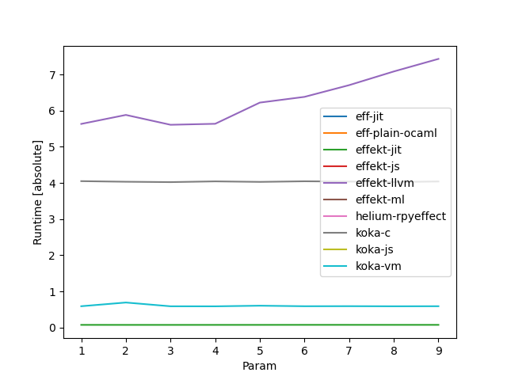
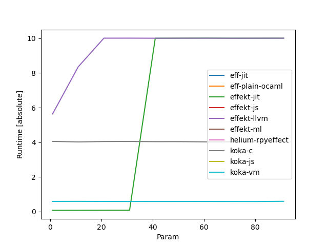

# 2024-07-11
- Eff benchmarks now run on jit.
- [in the log for countdown](./notes-ref/eff-jit_countdown_2024-07-11.log), we allocate some stack.
  also, it can see through most of it, but checks that stack etc didn't change (by ptr eq).
  Then, it specializes to a simple counter, although the code would have actually generated closures.
- Benchmark results:
  
  
# 2024-07-17
- non-naive implementation with multiple segments for multiple handler clauses, and separate instructions dynamic binding/continuation capture
- Effekt passes handlers in registers, Eff on stack
- Add allocation site to label, promote and compare first
  - might make handler sieve worse at new_with_vtable 8?
# 2024-07-18
- results before this change backupped to [notes-ref](./notes-ref/resback20240718/), jit at cc2df3a
- results after, no promote yet backupped to [notes-ref](./notes-ref/resback20240718_2/), jit at 8fde10d
- results after, with promote backupped to [notes-ref](./notes-ref/resback20240718_3/), jit at ca41098
- TODO: Make benchmarks for unused handlers, benchmark by number, with:
   - best case: different handler
   - worst case: all with label from same program position
   - pushing on the outside? (copy stack?)
   - https://dl.acm.org/doi/pdf/10.1145/2887747.2804319
- TODO Skynet benchmark from Jonas thesis?
- TODO Coroutine standard benchmarks?
  - http://aleksandar-prokopec.com/resources/docs/coroutines-ecoop.pdf
# 2024-07-19
- benchmark multiple_handlers implemented in eff: plain-ocaml times out, current jit is sim. to koka-vm
- unused_handlers (with 10 unused handlers) implemented in koka,eff. Compared to countdown:
  - effekt-ml cant run (eff.poly.rec.)
  - effekt-jit abt same time as countdown, so for other jit backends
  - koka-c,eff-plain-ocaml also like before
  - effekt-llvm a lot slower, koka-js somewhat (10%)
# 2024-07-24
- benchmark to_outermost_handler for koka.
  - eff seems impossible? We can't mask, it's always dynamic
  - koka has problems with incrementing boxed ints (re-unbox, inc, box in trace)
- this + restriction on polymorphic equals (esp. Eff): Maybe drop erased ptrs and switch to Value type?
  - Strings? io streams? (byte)arrays? (the rest should mostly just work)
  - @CF: Vptrs? worth it?
  - if we do, we probably want to also use ints for chars
# 2024-07-25
- to_outermost_handler over number of handlers:
  - 
  - 
  - Weird non-continuity: Trace gets too long, see [log](./notes-ref/to_outermost_handler_effekt_41.log)
    - in koka: see log [log](./notes-ref/to_outermost_handler_koka_41.log)
      - not optimized out statically, at least mask is still in generated code
  - results stored [here](./notes-ref/resback20240725/)
- hnd.kk:668 makes tail resumption non-tail
# 2024-07-31 / Meeting
## Questions to ask CF
- opt from last time (first check label origin): Makes worse in equal case?
  - note: worst part in countdown is boxing
- Trace too long problem (07-25)
- polymorphic equals/RTTI and boxes (see 07-24) - did not get to that, ask later
## Notes from meeting
- microbenchmark with dynamic number of handlers in between - growing_cont
- TODO benchmark to_outermost_handler fully
- TODO trmc that fails statically?
  - future work: jit-trmc
# 2024-07-31
- Maybe create set/matrix of benchmarks for different (explicit!) scenarios:
  - label dynamic/static
  - handlers in between static/dynamic/limited/...
  - handlers tail/nontail/... linear/...
  - ...
  - Potentially: parametrized (generated) benchmark code